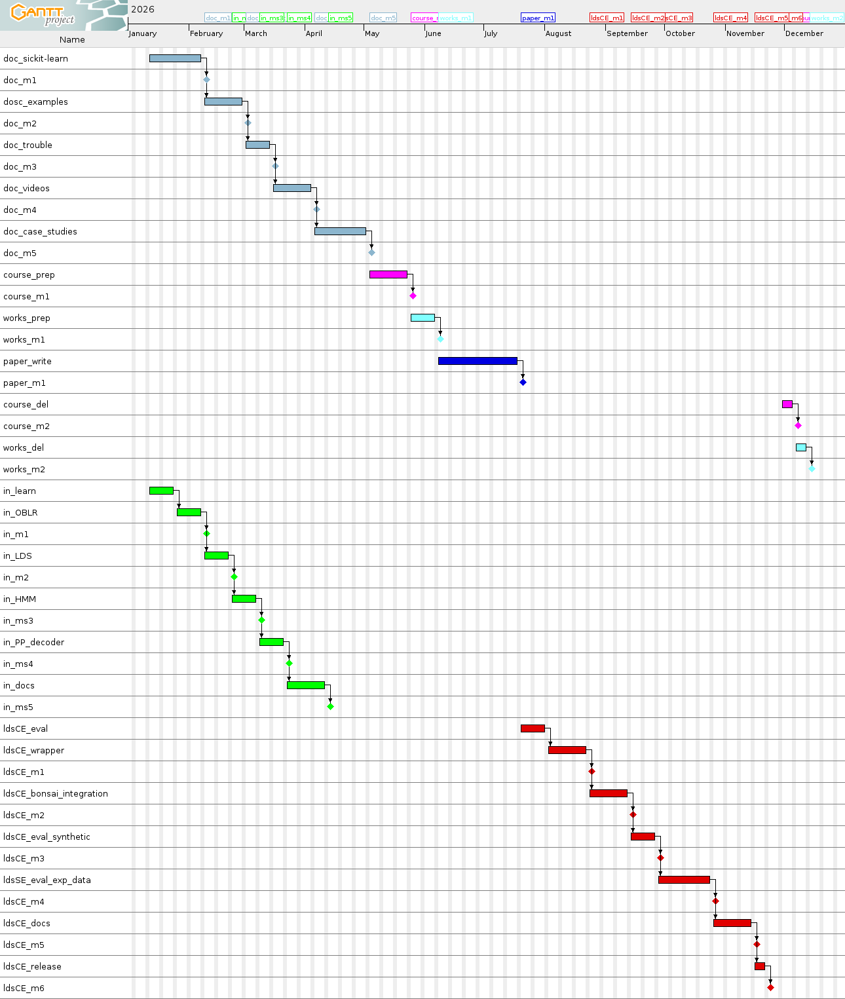

---
bibliography:
- bonsai.bib
- longDurationExperimentation.bib
- physiology.bib
- optogenetics.bib
- closeLoopControlOfNeuralActivity.bib
- latentsVariablesModels.bib
- messagePassing.bib
- neuralControl.bib
title: '[Research Software Maintenance Found -- Round
  1](https://www.software.ac.uk/research-software-maintenance-fund/round-1)'
---

Title {#title .unnumbered}
=====

Consolidating Bonsai as a Standard for Neuroscience Intelligent
Experimental Control

Summary
=======

Please provide a summary in plain English of your proposed work.

This summary will be made publicly available on external-facing
websites, therefore do not include any confidential or sensitive
information.

Please note that by submitting an application, you consent to the
information provided on this page (Project Summary, UKRI areas) being
publicly disseminated. This includes information from both successful
and unsuccessful applications. Information supplied in the other
sections of the application will not be published.

It may also be used to help identify suitable reviewers.

Summary (500 words)
-------------------

[Bonsai](https://bonsai-rx.org/) is a free and open-source visual
reactive programming language widely used for experimental control in
neuroscience. Designed for performance, flexibility, and ease of use,
Bonsai enables scientists with little or no programming background to
build high-performance data acquisition and control systems. With more
than 7,000 downloads annually, nearly 100 citations per year of the core
paper, and over 1,000 new users in 2024 alone, Bonsai has become the
most widely adopted software platform in systems neuroscience. Its
success demonstrates the transformative role that sustainable,
community-driven research software can play in accelerating discovery.

A central priority of UKRI is the application of [artificial
intelligence in
bioscience](https://www.ukri.org/what-we-do/browse-our-areas-of-investment-and-support/artificial-intelligence-in-bioscience/).
In 2022 we recognised that integrating machine learning (ML) into Bonsai
could be transformative for experimental neuroscience. With BBSRC
support
([BB/W019132/1](https://gow.bbsrc.ukri.org/grants/AwardDetails.aspx?FundingReference=BB%2FW019132%2F1)),
we developed [Bonsai.ML](https://bonsai-rx.org/machinelearning/), which
extends Bonsai with state-of-the-art ML methods. These include [Linear
Dynamical
Systems](https://bonsai-rx.org/machinelearning/examples/examples/LinearDynamicalSystems/README.html),
[Hidden Markov
Models](https://bonsai-rx.org/machinelearning/examples/examples/HiddenMarkovModels/README.html),
[Deep Neural Networks (Torch; trained
online)](https://bonsai-rx.org/machinelearning/examples/examples/Torch/NeuralNetsTrainedOnline/README.html),
and a [Point-Process
Decoder](https://bonsai-rx.org/machinelearning/examples/examples/PointProcessDecoder/DecodePositionFromHippocampusSortedUnits/README.html).
Embedding these models directly in Bonsai's reactive programming
environment enables adaptive, data-driven experimental designs that were
previously out of reach for many laboratories.

To maximise the impact and long-term sustainability of Bonsai.ML, this
proposal pursues six aims:

1.  **Documentation** -- Produce comprehensive, user-centred
    documentation that makes ML tools accessible to non-specialists
    across the neuroscience community.

2.  **Training** -- Develop and deliver a practical training course on
    Bonsai and Bonsai.ML, building capacity and lowering barriers to
    adoption.

3.  **Dissemination** -- Publish the first Bonsai.ML paper to increase
    visibility and uptake within the scientific community.

4.  **Maintainability** -- In collaboration with Microsoft Research
    Cambridge, integrate their C\# probabilistic programming library
    *Infer.NET* into Bonsai.ML. This will simplify and unify inference
    and learning code, making it faster, more maintainable, and more
    extensible, while embedding the expertise of a world-leading
    industrial research group into the Bonsai ecosystem.

5.  **Community reach** -- Engage neuroscientists interested in
    *closed-loop* neural experimentation by supporting the use of
    [CLOCTools](https://cloctools.github.io/) within Bonsai.ML, in
    collaboration with Prof. Garrett Stanley (Georgia Tech). This
    partnership will attract a new community of researchers to Bonsai
    and broaden its reach to an emerging but underrepresented area of
    neuroscience.

6.  **Community building** -- Strengthen the developer community by
    organising the second Bonsai Developers Conference in December 2026,
    building on the successful inaugural event in 2024.

7.  **Governance** -- Establish a steering committee to guide a
    long-term roadmap, prioritise sustainability, and supervise
    development throughout the grant.

By the end of the funding period, Bonsai.ML will provide high-quality
documentation and training resources, a robust and maintainable
codebase, and a stronger developer community with expanded expertise and
broader reach. In particular, collaborations with Microsoft Research
Cambridge and Prof. Garrett Stanley's laboratory will embed cutting-edge
knowledge in probabilistic inference and closed-loop experimentation.
Together, these efforts will ensure Bonsai remains a sustainable, widely
adopted research software platform, aligned with UKRI's strategic
priorities in artificial intelligence, bioscience, and community-driven
research software sustainability.

Core Team
=========

Tell us who will deliver the proposed work. Create an entry for each
core team member.

This section is for naming the people who will make key contributions to
the work.

Any unnamed role resource, such as a research software engineer role
where an individual has not yet been identified, should be included and
justified in the Resources section. All project leads (including
international ones, as well as co-leads) need to be named.

If a single person has multiple roles, select the main one under
\"Role\" There can only be one project lead, and they must be based at
an eligible UK Research Organisation. The project lead should normally
be the person submitting the application. If the project lead has
changed since the EoI, please contact us to have an invitation to the
new lead issued.

Software
========

Please provide details of the software to be supported.

This information may be used by reviewers as part of the assessment of
your application. It may also be used to provide an anonymised and
aggregated summary across all applications.

a\. Software to be maintained:

:   [Bonsai](https://bonsai-rx.org/)

b\. Code repository (optional):

:   <https://github.com/bonsai-rx/bonsai>

c\. Website (optional):

:   <https://bonsai-rx.org/>

d\. Year development started:

:   2011

e\. Year of first release:

:   2013

f\. Programming language:

:   C\#

Vision
======

Please describe what you are hoping to achieve with this funding.

Discuss both your vision and objectives for the technical development,
as well as your plans to improve your software's sustainability and
support EDIA considerations.

Vision (300 words)
------------------

Explain how your proposed work will:

-   have a benefit and impact on research, with specific examples of
    research impact in the UK

-   build the community around the software

-   increase the adoption of the software

-   improve the maintainability of the software

-   advance good practice

More than a decade ago, Dr. Gonçalo Lopes created
[Bonsai](https://bonsai-rx.org/), a reactive visual programming language
for neuroscience experiment control. Today, Bonsai has become the most
widely used tool of its kind, adopted by thousands of laboratories
worldwide, with over 7,000 downloads annually and nearly 100 citations
per year of the core Bonsai paper [@lopesEtAl15]. It has already
transformed experimental design by enabling studies of a complexity
previously unimaginable.

In 2022, we recognised that integrating machine learning (ML) into
Bonsai could enable a new generation of intelligent experimental
control. With BBSRC support, we developed
[Bonsai.ML](https://bonsai-rx.org/machinelearning), a package that
seamlessly incorporates advanced ML functionality into the Bonsai
ecosystem.

Our proposal will accelerate the uptake and impact of Bonsai.ML through
complementary strategies. First, we will provide high-quality ML
methods, supported by comprehensive documentation, training, and
dissemination. This will empower experimental neuroscientists to explore
and identify "killer applications" independently. Second, we will
collaborate directly with neuroscientists to address specific research
challenges, demonstrating Bonsai.ML's transformative potential through
real-world case studies. This interdisciplinary effort leverages our
unique expertise in software engineering, ML, and experimental
neuroscience.

Community engagement will be central to success. A Bonsai developers
conference and targeted community-building activities will consolidate
and expand the user base, while training courses and dissemination will
promote best practices in sustainable software development. The
integration of a C\# probabilistic programming language will simplify
and unify inference and learning code, improving maintainability and
enabling scalable online learning. Finally, an international steering
committee will guide research priorities, oversee development, and help
establish a long-term roadmap, ensuring sustainability.

With Bonsai.ML, we aim to spark a second revolution in experimental
neuroscience--- empowering researchers to design adaptive, intelligent
experiments that were previously beyond imagination.

Objectives (200 words)
----------------------

Clearly describe the aims and objectives of this work.

The central objective of this proposal is to **facilitate the adoption
of machine learning for neuroscience experimental control**. Our
approach builds on Bonsai.ML, an extension of the widely used Bonsai
platform, which equips neuroscientists with accessible, high-performance
tools for intelligent and adaptive experimentation.

To achieve this aim, we will pursue three interconnected objectives.
First, we will promote **community uptake** by producing clear,
comprehensive documentation, delivering a Bonsai course, and
disseminating Bonsai.ML through a paper and a Bonsai developers
conference. These activities will lower barriers for non-specialist
users, empower experimentalists to explore machine learning in their own
work, and foster a vibrant, self-sustaining community of users and
contributors.

Second, we will improve **software maintenance** by simplifying the
existing codebase and strengthening extensibility by integrating into
Bonsai.ML the C\# probabilistic programming language Infer.NET. This
will make Bonsai.ML faster, more robust, easier to maintain, and more
adaptable to evolving research needs.

Finally, we will ensure the **long-term sustainability and alignment**
of Bonsai.ML with the neuroscience community by convening an
internationally recognised steering committee. This group will provide
guidance on priorities, governance, and strategic planning, ensuring
that Bonsai.ML remains a reliable, community-driven platform for
cutting-edge experimental neuroscience.

Timeliness and Sustainability (300 words)
-----------------------------------------

Justify why it is important that your project is funded in this round,
and include:

-   why it is important that this work is funded now, rather than at a
    different time

-   what other funding sources have been investigated, and why these are
    not suitable

-   how the software will be sustained and maintained after the RSMF
    funding ends, and how the RSMF funding will help achieve this

### Timeliness {#timeliness .unnumbered}

The last few years have demonstrated the transformative potential of ML
in biology. For example, the 2024 Nobel Prize in Chemistry was awarded
to Demis Hassabis, a former Gatsby Unit PhD student, for his pioneering
work on applying ML to protein structure prediction. New opportunities
now exist for integrating ML into experimental control in neuroscience
and biology. Capturing these opportunities quickly is essential to
ensure that the UK remains at the forefront of this field.

### Other sources of support {#other-sources-of-support .unnumbered}

We have considered other funding mechanisms. A BBSRC Standard Research
Grant is not appropriate at this stage, as Bonsai.ML is not yet embedded
in a major biological research programme. Likewise, a BBSRC Follow-on
Fund is not a fit, as we cannot currently point to a single application
of Bonsai.ML with immediate transformative economic or societal impact.

### Sustainability {#sustainability .unnumbered}

Bonsai.ML will be sustained beyond the RSMF funding period through a
combination of community, institutional, and commercial support.
NeuroGEARS, which already underpins the wider Bonsai ecosystem, invests
a fixed proportion of its service income into Bonsai maintenance and
will extend this support to Bonsai.ML.

Our academic partners are also strongly invested. The Sainsbury Wellcome
Centre (SWC) relies on Bonsai for experimental control and Bonsai.ML for
advanced control in some of its experiments, and contributes financially
to its development. The Gatsby Unit will continue to provide machine
learning expertise to guide Bonsai.ML's growth. Prof. Stanley's lab will
contribute its expertise in the control of physiological signals to
extend Bonsai.ML's capabilities.

Finally, our collaboration with Microsoft Research Cambridge ensures
that Infer.NET integration brings sustained industrial expertise to
Bonsai.ML, strengthening its long-term sustainability beyond the funding
period.

EDIA (300 words)
----------------

Explain how you will embed equity, diversity, inclusivity and
accessibility considerations into your proposed work and the software
being maintained, and how these will guide your aims, objectives,
activities and outputs.

This can include (but is not limited to) considerations applying to your
team, your community, and your software.

Approach (2000 words)
=====================

Explain what work you have planned, and how you will manage this. Cover
both the technical as well as project management areas.

Planned work

-   where applicable: summary of any previous work and how this will be
    built upon and progressed

-   where applicable: a clear and transparent methodology

-   effective and appropriate activities to achieve your objectives

-   which team members are responsible for each activity and task

-   expected outputs for each task and how they relate to each other

-   a timeline with a feasible workplan

-   strategy to maximise translation of outputs into outcomes and
    impacts

Management

-   how the work will be managed and progress monitored and evaluated

-   how the current software project governance and infrastructure will
    contribute to the success of the work

-   what risks to delivery were identified and how they will be managed

Approach
--------

### Aim 1: Documentation

3.25ex 1ex .2ex -1em Summary: Improve the current Bonsai.ML
documentation.

3.25ex 1ex .2ex -1em Background: The current Bonsai.ML documentation
includes installation guides, API references, and examples, but it lacks
essential statistical explanations, clear connections between methods,
and a well-structured organisation. Users have reported redundancy, gaps
in clarity, and difficulty finding information, creating friction for
newcomers. In addition, documentation for machine learning method
developers is scattered across disparate sources rather than being
centralised. Inspired by the model of
[scikit-learn](https://scikit-learn.org/), which combines conceptual
background with tutorials and API references, we aim to restructure and
expand Bonsai.ML documentation into a comprehensive, accessible resource
that serves both experimental neuroscientists and method developers.

3.25ex 1ex .2ex -1em Tasks:

doc_structure:

:   Restructure documentation in the style of `scikit-learn` (4 weeks).

doc_examples:

:   Add at least 3 neuroscience-focused examples (3 weeks).

doc_trouble:

:   Create a troubleshooting section with common issues (2 weeks).

doc_videos:

:   Produce 3 tutorial videos, hosted on YouTube and embedded in the
    docs (3 weeks).

doc_cases:

:   Develop 2 case studies on intelligent experimental control in Bonsai
    (4 weeks).

3.25ex 1ex .2ex -1em Milestones and Indicators:

doc_m1/i1:

:   Documentation restructured and published on the Bonsai.ML site.

doc_m2/i2:

:   Three new neuroscience examples added and published.

doc_m3/i3:

:   Troubleshooting section online with at least 10 issues addressed.

doc_m4/i4:

:   Three tutorial videos produced, uploaded, and linked in the docs.

doc_m5/i5:

:   Two case studies completed and published in a new Case Studies
    section.

3.25ex 1ex .2ex -1em Responsible team members: NG

------------------------------------------------------------------------

### Aim 2: Training

3.25ex 1ex .2ex -1em Summary: Organise a Bonsai course with a dedicated
Bonsai.ML module.

3.25ex 1ex .2ex -1em Background: Since 2017, NeuroGEARS Ltd has
organised at least two Bonsai courses per year at different universities
around the world, and some of them can be [viewed
online](https://bonsai-rx.org/learn/). We will deliver a Bonsai course,
with a new Bonsai.ML module. It will be targeted to intermediate Bonsai
users, and will take place at the lecture theatre of the Sainsbury
Wellcome Centre, which is free for us. It will host a class size of
around 20 students. The structure of the course will be similar to that
of previous ones (e.g., [2024 Bonsai Course at St. Andrews
University](https://neurogears.org/st-andrews-2024/)), with the addition
of a Bonsai.ML module.

3.25ex 1ex .2ex -1em Tasks:

course_prep

:   Prepare course syllabus and teaching materials; secure venue;
    announce the course; recruit instructors, teaching assistants, and
    students. (3 weeks)

course_del

:   Deliver the course. (1 week)

3.25ex 1ex .2ex -1em Milestones and Indicators:

course_m1

:   Course publicly announced with detailed syllabus.

course_i1

:   Announcement disseminated via multiple channels (mailing lists, X,
    Mastodon, Linked In) with support from SWC and Gatsby Unit
    communication teams.

course_m2

:   Course delivered.

course_i2

:   Course recordings, slides, worksheets, and solutions made freely
    available on GitHub.

3.25ex 1ex .2ex -1em Responsible team members: GL

------------------------------------------------------------------------

### Aim 3: Dissemination

3.25ex 1ex .2ex -1em Summary: Publish first Bonsai.ML paper

3.25ex 1ex .2ex -1em Background: Specially in neuroscience, adoption of
open-source software greatly increase when they are supported by
scientific papers. In our own experiences, we have seen this happen many
times, with the foundational Bonsai paper [@lopesEtAl15], with the
BonVision paper [@lopesEtAl21], and with the BonZeb paper
[@guilbeaultEtAl21]. To increase adoption of Bonsai.ML, we will prepare
and submit for publication the first Bonsai.ML paper.

3.25ex 1ex .2ex -1em Tasks:\

paper_write:

:   Write first Bonsai.ML paper (4 weeks).

3.25ex 1ex .2ex -1em Milestones and Indicators:\

paper_m1

:   : First Bonsai.ML paper written.

paper_i1

:   : First Bonsai.ML paper available in
    [BioRxiv](https://www.biorxiv.org/).

------------------------------------------------------------------------

### Aim 4: Maintainability

3.25ex 1ex .2ex -1em Summary: Improve the runtime efficiency,
simplicity, and extensibility of Bonsai.ML code by integrating
Infer.NET.

3.25ex 1ex .2ex -1em Background: Most probabilistic models in Bonsai.ML
are currently implemented in Python, which helps attract Python
developers but limits performance in real-time applications.
Implementations in C\# and especially in a probabilistic programming
language (PPL) would be faster, simpler, and more homogeneous, since
PPLs abstract away the complexity of inference algorithms. Integrating a
PPL would make adding new models far easier and greatly improve
maintainability.

Fortunately, C\# has a mature PPL:
[Infer.NET](https://dotnet.github.io/infer/), developed at Microsoft
Research Cambridge, used in hundreds of papers, and open-sourced in
2018. Infer.NET delivers scalable, deterministic approximate inference,
enabling powerful models to be implemented in only a few lines of code.
Incorporating it into Bonsai.ML will accelerate inference, standardise
implementations, and make it much easier for neuroscientists to extend
the ecosystem.

Our collaborator Dr. Tom Minka, inventor of Expectation Propagation and
lead developer of Infer.NET, will support this effort.

3.25ex 1ex .2ex -1em Tasks:

in_learn:

:   The responsible team member, already skilled in probabilistic
    programming, will dedicate two weeks to learning Infer.NET (2
    weeks).

in_OBLR:

:   Re-implement the Online Bayesian Linear Regression (currently in
    C\#) using Infer.NET. Develop test cases to validate equivalence
    with the existing implementation (2 weeks).

in_LDS:

:   Re-implement the Linear Dynamical System model (currently in Python)
    in Infer.NET, with test cases to ensure equivalence (2 weeks).

in_HMM:

:   Re-implement the Hidden Markov Model (currently in Python) in
    Infer.NET, with test cases to ensure equivalence (2 weeks).

in_PPdecoder:

:   Re-implement the Point Process Decoder (currently in Python) in
    Infer.NET, with test cases to ensure equivalence (2 weeks).

in_docs:

:   Add detailed documentation for each model integrated above,
    describing implementation in Infer.NET (3 weeks).

3.25ex 1ex .2ex -1em Milestones and Indicators:

in_m1/i1:

:   OBLR implemented in Bonsai.ML.Infer.NET and published on
    `nuget.org`.

in_m2/i2:

:   LDS implemented in Bonsai.ML.Infer.NET and published on `nuget.org`.

in_m3/i3:

:   HMM implemented in Bonsai.ML.Infer.NET and published on `nuget.org`.

in_m4/i4:

:   Point Process Decoder implemented in Bonsai.ML.Infer.NET and
    published on `nuget.org`.

in_m5/i5:

:   Comprehensive documentation added for all models and published with
    the corresponding `nuget` packages.

in_m6/i6:

:   All Bonsai.ML.Infer.NET packages released and available on
    `nuget.org`.

3.25ex 1ex .2ex -1em Responsible team member: JR.

------------------------------------------------------------------------

### Aim 5: Community reach

3.25ex 1ex .2ex -1em Summary: Attract to Bonsai scientists interested in
close-loop control of neural activity by integrating functionality from
the [CLOCTools](https://cloctools.github.io/) software into Bonsai.ML.

3.25ex 1ex .2ex -1em Background: We will expand Bonsai.ML to support
closed-loop neural control by integrating functionality from
[CLOCTools](https://cloctools.github.io/) , developed by Prof. Garrett
Stanley's lab (Georgia Tech/Emory). While Bonsai already excels in
real-time behavioural control, this integration will make it the first
sustainable, general-purpose framework supporting both behavioural and
neural closed-loop experimentation. Existing closed-loop tools are often
ad hoc, difficult to install, and poorly integrated; Bonsai will provide
accessible, open-source, and maintainable solutions, lowering barriers
to adoption and enabling real-time read--write interaction with neural
activity. Concretely, we will create a Bonsai package that interfaces
with CLOCTools'
[lds-ctrl-est](https://github.com/CLOCTools/lds-ctrl-est) repository,
with Prof. Stanley's team maintaining the core library and our team
providing Bonsai integration.

3.25ex 1ex .2ex -1em Tasks:

ldsCE_eval:

:   Review and evaluate the functionality of
    [lds-ctrl-est](https://github.com/CLOCTools/lds-ctrl-est). (2 weeks)

ldsCE_wrapper:

:   Create C++/CLI wrappers to access `lds-ctrl-est` from C\#. (3 weeks)

ldsCE_integration:

:   Build the `Bonsai.ML.LDS-CTR-EST` package providing `lds-ctrl-est`
    functionality within Bonsai. (3 weeks)

ldsCE_testing:

:   Evaluate with synthetic data to ensure real-time performance (2
    weeks), and assist Prof. Stanley's lab in validation with
    experimental data (4 weeks).

ldsCE_docs:

:   Add documentation in line with other Bonsai.ML packages. (3 weeks)

ldsCE_release:

:   Release the package. (1 week)

3.25ex 1ex .2ex -1em Milestones and Indicators:

ldsCE_m1/i1:

:   Core functionality accessible from C\#, with examples from
    `lds-ctrl-est` replicated in C\# and shared on GitHub.

ldsCE_m2/i2:

:   Package integrated into Bonsai and available via the package
    manager.

ldsCE_m3/i3:

:   Package validated with synthetic data; latency figures documented.

ldsCE_m4/i4:

:   Experimental validation in collaboration with Prof. Stanley's lab,
    with results (e.g. steady-state firing rate control as in
    @bolusEtAl21) documented on GitHub.

ldsCE_m5/i5:

:   API documentation, examples, and tutorials completed.

ldsCE_m6/i6:

:   Package released and available on `nuget.org`.

3.25ex 1ex .2ex -1em Responsible team members: JR

------------------------------------------------------------------------

### Aim 6: Community building

3.25ex 1ex .2ex -1em Summary: Organise the 2026 Bonsai developers
conference

3.25ex 1ex .2ex -1em Background: A Bonsai developer conference is a
week-long meetings aimed at bringing together neuroscience researchers,
computational scientists, and software engineers who are interested in
developing and using the Bonsai visual reactive programming language.

The first edition of this conference took place at the Sainsbury
Wellcome Centre on December 2024. It was attended by 30 scientists and
engineers from around the world, including representatives from the
Allen Institute for Neural Dynamics, Janelia Research Campus,
Massachusetts Institute of Technology, and University College London, to
mention a few. The website of the first edition of this conference can
be found [here](https://conference.bonsai-rx.org/2024/). The proceedings
repository of the first conference is still under construction, but can
be accessed from
[here](https://github.com/joacorapela/bonsaiConference2024Proceedings),
and the summary of its Bonsai.ML session can be read
[here](https://github.com/joacorapela/bonsaiConference2024Proceedings/blob/master/sessions/machineLearning/README.md).

In this first edition of the conference we voted to hold the second
edition in 2026. We propose to organise and deliver it as part of this
project.

3.25ex 1ex .2ex -1em Tasks:

conf_prep:

:   Prepare program, invite speakers, arrange venue and logistics,
    announce event, and select participants (3 weeks).

conf_del:

:   Deliver the conference (1 week).

conf_proc:

:   Prepare proceedings (2 weeks).

3.25ex 1ex .2ex -1em Milestones and Indicators:

conf_m1/i1:

:   Event announced via mailing lists and social media (X, Mastodon),
    with preliminary program and speaker list.

conf_m2/i2:

:   Event delivered; raw video recordings shared with the Research
    Software Management Fund.

conf_m3/i3:

:   Proceedings released in a GitHub repository, including attendance
    list, recordings, narrative summaries, slides, and exercises with
    solutions (cf. [2024 conference
    proceedings](https://github.com/joacorapela/bonsaiConference2024Proceedings)).

------------------------------------------------------------------------

### Aim 7: Governance

3.25ex 1ex .2ex -1em Summary: Establish and convene a steering committee
to guide milestones, review progress, and shape a long-term development
roadmap.

3.25ex 1ex .2ex -1em Background: We will assemble a Bonsai.ML steering
committee that will be responsible for approving project milestones and
advise us on building a long-term development roadmap for Bonsai.ML.
Responding to guidance and feedback from the steering committee ensures
Bonsai.ML addressed pressing neuroscience needs on an international
scale.

Several renowned experimental and computational neuroscientists around
the world are heavily invested in Bonsai, and are very interested in
adding ML functionality to their Bonsai workflows. We have already
invited a few of them to join the Bonsai.ML steering committee:
Prof. Garrett Stanley, Prof. Aman Saleem and Dr. Josh Siegle. Please
refer to their letters of support.

We will meet with the steering committee four times in 2026. These
meetings will happen at the end of January, April, August and November,
respectively. Before each meeting, we will prepare a progress report and
send it to the committee members two weeks before the meeting. After
each meeting we will write a follow-up report with meetings minutes and
the revised project roadmap.

3.25ex 1ex .2ex -1em Tasks:

sc_assembly:

:   Complete the assembly of the steering committee.

sc_meet{i}:

:   Meet with the steering committee for this ith time, with
    $i\in\{1,2,3,4\}$.

3.25ex 1ex .2ex -1em Milestones and Indicators:\

sc_m0:

:   Steering committee assembled.

sc_i0:

:   Documented published in the project GitHub repository with names and
    affiliations of the steering committee members.

sc_m{i}:

:   ith steering committee meeting held.

sc_i{i}

:   Progress and follow-up reports for the ith meeting.

------------------------------------------------------------------------

Management
----------

We will conduct management activities at different frequencies:

Quarterly:

:   we will convene the steering committee. Two weeks in advance of each
    meeting, we will circulate a progress report summarising achieved
    milestones, proposed future activities, and the most recent version
    of the Bonsai.ML long-term roadmap. The steering committee will
    review the report, endorse completed milestones, and provide
    feedback or suggestions on planned activities. Based on project
    progress and committee input, we will revise the long-term roadmap,
    ensuring that Bonsai.ML development remains aligned with community
    needs and strategic goals. Minutes and key decisions from these
    meetings will be documented and, shared with the Research Software
    Maintenance Fund.

Monthly:

:   we will hold meetings between the project lead, the project co-lead,
    the RSE, and the external project co-lead, to evaluate the project
    progress.

Weekly:

:   as has been our practice since the start of the Bonsai.ML project,
    the RSEs will meet with the external project co-lead to discuss
    issues that appeared during the week, review activities for the
    following week, and adjust project directions.

Meetings with collaborators will be arranged as needed. At the SWC, GCNU
and NG we are experimental and computational neuroscientists with
successful collaborative experience, and we have no doubt that the
proposed collaborations will be of the same kind, specially since we
have successfully interacted in the past with most of the propose
collaborators. Please refer to their letters of support.

Workplan (optional)
-------------------

You may choose to upload a one page document such as a Gantt chart to
help illustrate timing of and links among the activities.

{width="6.5in"}

Capability to deliver (1000 words)
==================================

Provide evidence of how you and your team have:

-   the relevant experience (appropriate to career stage) to deliver the
    objectives

-   the right balance of skills and expertise to cover the proposed work

-   the appropriate leadership and management skills to ensure delivery

-   contributed to developing good practice in your communities

Where applicable, discuss your approach to developing others.

Relevant Experience
-------------------

TMF is an experimental neuroscientists and director of the SWC. Research in his laboratory aims to explain how the brain makes decisions by combining sensory information with previously learned knowledge. As the behavioural tasks used in his lab require complex software-control of data acquisition and data analysis pipelines, he knows first-hand their crucial importance for driving and enabling neuroscientific research.

He has published 49 peer-reviewed papers, with an h-index of 35 (calculated by google scholar). He is a founding member of the International Brain Laboratory (IBL et al 2019 Neuron). The Bonsai ecosystem is critical to IBL, as it ensures that experimental control, stimulus presentation and data acquisition can be identically reproduced across all participating labs in UK, Europe and USA (IBL et al 2021, eLife).

MS is a computational neuroscientist and director of the Gatsby Unit. He has authored over 150 peer-reviewed scientific papers, with an h-index (computed by Google scholar) of 57. A substantial component of his research focuses on the development of advanced machine-learning tools for neuroscience research.

Beginning around 2005, his group published a series of new neuroinformatics tools designed to characterise and understand population-scale activity using the large-scale multielectrode recording methods. These papers provided the backbone for a new analytic approach that is now being employed and extended by systems neuroscience laboratories worldwide. A central component of the current proposal is to disseminate this approach (and others) already available within Bonsai, easing its adoption by a wider group of laboratories that lack in-house informatics expertise.

GL is the creator of Bonsai and has ample experience in software engineering, holding a Licentiate degree in Computer Science from NOVA University Lisbon, and having worked between 2006 and 2010 at the NOVA CENTRIA Artificial Intelligence laboratory, and at YDreams, where he was leading a team developing a ground-breaking engine for Augmented Reality.

Transitioning into his neuroscience PhD at the Champalimaud Foundation, he created the Bonsai visual programming language to run his PhD experiments, which then led him to managing a software development company serving thousands of users and collaborating with leading universities and research centres around the world.

JR specialises in signal processing and machine learning, with applications to understanding brain function (Rapela et al., 2006, Rapela et al., 2010, Rapela et al., 2018 and Rapela et al., 2019).

He has extensive software development expertise, holding a Master's degree in Computer Science and industry experience at IBM Argentina and the IBM Almaden Research Center, US. He joined the Gatsby Computational Neuroscience Unit in 2019 as a Research Engineer Fellow. He is the lead developer of [Sparse Variational Gaussian Process Factor Analysis (svGPFA)](https://github.com/joacorapela/svGPFA), and has openly released several other machine learning packages including linear dynamical systems in [Python](https://github.com/joacorapela/ssm) and [R](https://github.com/joacorapela/kalmanFilter), [Hidden Markov Models](https://github.com/joacorapela/hiddenMarkovModels) in R, and [Bayesian Linear Regression](https://github.com/joacorapela/bayesianLinearRegression) in Python.

JR played a leading role in securing the BBSRC grant that funded the creation of Bonsai.ML and has led its development since the project's inception. He also played a central role in preparing the current proposal.

NG is a research software engineer with expertise in real-time machine learning, neural data analysis, and open-source software development. He holds a PhD in neuroscience from the University of Toronto, where he developed the [BonZeb](https://ncguilbeault.github.io/BonZeb/) software for zebrafish kinematic tracking, closed-loop stimulation, and neural data analysis.

Since joining the Gatsby Computational Neuroscience Unit in 2023, Dr. Guilbeault has served as the core developer of the [Bonsai.ML](https://bonsai-rx.org/machinelearning) project, integrating machine learning methods into the Bonsai visual reactive programming language.

Balance of Skills and Expertise
-------------------------------

Our team has the required expertise, at the leadership and development levels, in machine learning (MS, JR, NG), software development (GL, JR, NG), neuroscience (TMF, MS, GL, JR, NG) and experimental control (GL, NG).

Our expertise is complemented by that of world-class project partners in close-loop neural control (Prof. Garrett Stanley), probabilistic programming (Dr. Tom Minka), high-channel-count electrophysiological recordings (Dr. Josh Siegle) and vision and navigation (Prof. Aman Saleem). Please refer to their letters of support.

Leadership and Management Skills
--------------------------------

TMF is the Director of the Sainsbury Wellcome Centre (SWC) at University College London. He is responsible for setting the Centre's strategic and scientific direction, which currently comprises 12 experimental labs. In addition, he has line management responsibilities for the Executive Team, several members of the SWC Faculty, and numerous scientific and administrative support staff.

MS has been Director of the Gatsby Computational Neuroscience Unit since 2017, leading strategy in research and teaching. He has overseen recruitment to new strategic roles, as well as new members of the Unit faculty. As Director, he sits in the Executive Leadership Committee of the Faculty of Life Sciences at UCL.

GL is the Founder and Director of NeuroGEARS since 2017, where he has led a diverse team of scientists, engineers and artists in the development of novel experimental platforms across multiple model organisms. He has also directly contributed in the organisation and teaching of Bonsai for neuroscience experimentation worldwide, and was part of the creation of the Neuronauts educational outreach programme. Currently, NeuroGEARS employs 8 scientists and engineers across the UK, US and Portugal.

JR has lead a small team of RSEs in the creation of the Bonsai.ML package since 2023.

Contribution to Developing Good Practice in Communities
-------------------------------------------------------

Bonsai is an open-source platform built with robust software engineering practices, including modular design, automated testing, semantic versioning, and comprehensive documentation. Its development is deeply community-driven, with contributions from labs and companies worldwide, training workshops, conferences, and active online forums. Sustained by public/private funding and the Bonsai Foundation CIC, Bonsai promotes transparency, reproducibility, and long-term sustainability in neuroscience software.

Developing others
-----------------

TMF has led a laboratory since 2008. He has successfully supervised 12 MA students, 9 PhD students, and 14 postdoctoral scholars.

MS has led a laboratory since 2004, and has supervised a total of 18 PhD students and 17 postdoctoral fellows.

GL has supervised and trained over 10 scientists and engineers at NeuroGEARS since 2017, and co-supervised 2 iCASE studentships in collaboration with UCL faculty.

JR co-mentored a masters, two undergraduate students and is advising an RSE in machine learning methods development.

Project partners
================

A project partner is a collaborating organisation that plays an integral
role in the proposed work. You should describe the nature of this
support in the Approach section of your application.

Project partners contribute to the delivery of the project and should
not normally request funding from the grant. However, travel and
subsistence costs incurred by the lead organisation to enable project
partner involvement may be included---these must be fully justified in
the Resources section.

You cannot include an individual as an applicant (i.e., project lead,
co-lead, or any Core Team role) if they, or their organisation, are
named as the project partner contact.

All project partners must be listed as contributors below, and a letter
of support for each must be uploaded as a single combined PDF.

Letter(s) of Support (optional)
-------------------------------

Resources
=========

Please provide details of the funding requested.

Use the breakdown categories listed in this section, and discuss the
main resource requirements.

You will also need to upload a consolidated budget from the lead
organisation using a standard FEC costing format.

Justification of resources (1000 words)
---------------------------------------

Justify the application's more costly resources, in particular:

-   any staff costs

-   significant costs related to collaboration or community engagement

-   any consumables beyond typical requirements

-   infrastructure costs

-   all resources that have been costed as 'Exceptions'

You do not need to justify Estates and Indirect costs.

We are not looking for a detailed breakdown of each cost, but want you
to demonstrate how the resources you are applying for are comprehensive,
appropriate and justified, and represent the optimal use of resources to
achieve the intended outcomes.

3.25ex 1ex .2ex -1em Staff costs: cover the salary of two research
software engineers working on the project.

3.25ex 1ex .2ex -1em Community engagement: The directly incurred
`Other costs` cover the costs of one training curse and one developers
conference. These cost only cover food expenses, as the venue is
provided free of charge by the Sainsbury Wellcome Centre.

3.25ex 1ex .2ex -1em Cash contributions: NeuroGEARS will contribute
£5,733.60 in cash towards salary support for one RSE.

3.25ex 1ex .2ex -1em In-kind contributions: NeuroGEARS will provide
in-kind contributions valued at £100,000, including:

1.  Supporting the organisation of a Bonsai course, including a
    Bonsai.ML module, and providing instructors for its delivery.

2.  Supporting the organisation of the 2026 Bonsai Development
    Conference, including a Bonsai.ML session, and providing instructors
    for its delivery.

3.  Organising and deploying a Bonsai booth, including a Bonsai.ML
    exhibit, at the 2025 Society for Neuroscience Annual Meeting,
    similar to that deployed in 2024.

4.  Delivering Bonsai and Bonsai.ML lectures at the annual [Sainsbury
    Wellcome Centre Statistical Neuroscience
    course](https://github.com/joacorapela/statNeuro2025).

5.  Contributing director time to the Bonsai.ML weekly meetings.

6.  Providing Bonsai technical support to members of the Bonsai.ML team.

Total funding requested:
------------------------

£283,384.02

Directly incurred - Staff:
--------------------------

£130,539.22

Directly incurred - Travel and Subsistence:
-------------------------------------------

£0.0

Directly incurred - Other:
--------------------------

£13,600

Directly allocated - Staff:
---------------------------

£0.0

Directly allocated - Estates:
-----------------------------

£26,100.80

Directly allocated - Other:
---------------------------

£0.0

Indirects:
----------

£113.144

Exceptions:
-----------

£0.0
